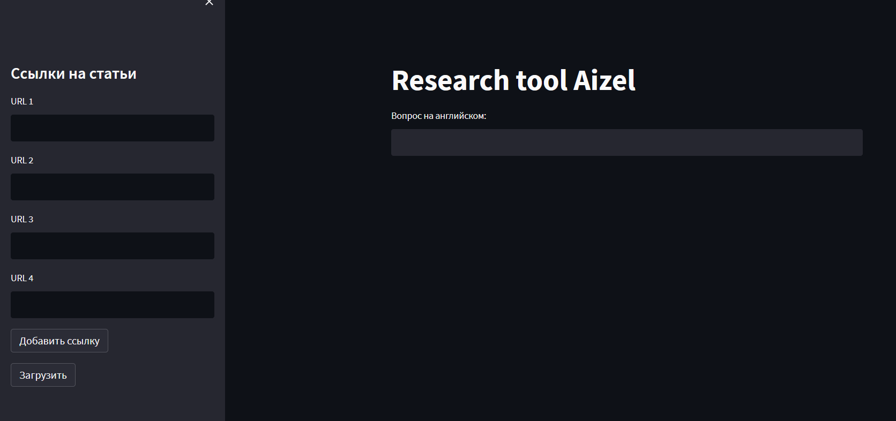

# Research tool

Коротко, вставляется ссылки с научными статьями, и задаете свои вопросы, а модель(Open ai chatgpt) отвечает на них.  



## Installation

1.Clone this repository to your local machine using:

```bash
  git clone https://github.com/aizeld/ResearchTool.git
```
2.Navigate to the project directory:

```bash
  cd ResearchTool
```
3. Install the required dependencies using pip:

```bash
  pip install -r requirements.txt
```
4.Set up your OpenAI API key by creating a .env file in the project root and adding your API

```bash
  OPENAI_API_KEY=your api key
```
5.Run the Streamlit app by executing:
```bash
streamlit run main.py
```

## Project Structure

- main.py: The main Streamlit application script.
- requirements.txt: A list of required Python packages for the project.
- faiss_store_openai.pkl: A pickle file to store the FAISS index.
- .env: Configuration file for storing your OpenAI API key.
